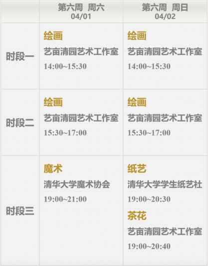

# 共青团清华大学委员会“阳光同行”班团工作资源手册

[//]: # (![bba1cd11728b471024d7e23bc3cec3fdfd032348]&#40;media/7e36c8e5efffb32225b9f5c595762ad3.jpeg&#41;)

[//]: # ()

[//]: # (![]&#40;media/3e891d805b192bd3b3c0913bb348804e.png&#41;)

[//]: # (2023年04月)

[//]: # ()

[//]: # (目录)

[//]: # ()

[//]: # ([〇、前言 1]&#40;#〇前言&#41;)

[//]: # ()

[//]: # ([一、德育资源 2]&#40;#_Toc132577901&#41;)

[//]: # ()

[//]: # ([（一）工作室顾问 2]&#40;#一工作室顾问&#41;)

[//]: # ()

[//]: # ([（二）工作室优秀班团骨干 2]&#40;#二工作室优秀班团骨干&#41;)

[//]: # ()

[//]: # ([（三）校友嘉宾 3]&#40;#三校友嘉宾&#41;)

[//]: # ()

[//]: # ([（四）无偿献血 3]&#40;#_Toc132577905&#41;)

[//]: # ()

[//]: # ([（五）校园急救培训 4]&#40;#五校园急救培训&#41;)

[//]: # ()

[//]: # ([（六）急救小班与赛场救护 5]&#40;#六急救小班与赛场救护&#41;)

[//]: # ()

[//]: # ([（七）校园讲解红色专线 7]&#40;#七校园讲解红色专线&#41;)

[//]: # ()

[//]: # ([（八）清华大学学生社团公益宣讲团 8]&#40;#八清华大学学生社团公益宣讲团&#41;)

[//]: # ()

[//]: # ([（九）西体训练营参观 10]&#40;#九西体训练营参观&#41;)

[//]: # ()

[//]: # ([（十）“闻道”系列讲座活动 11]&#40;#十闻道系列讲座活动&#41;)

[//]: # ()

[//]: # ([（十一）时事大讲堂专题系列讲座活动 11]&#40;#十一时事大讲堂专题系列讲座活动&#41;)

[//]: # ()

[//]: # ([（十二）“奋进新时代”宣讲团 12]&#40;#十二奋进新时代宣讲团&#41;)

[//]: # ()

[//]: # ([（十三）学生求是学会宣讲团 15]&#40;#十三学生求是学会宣讲团&#41;)

[//]: # ()

[//]: # ([（十四）特色实践基地 17]&#40;#十四特色实践基地&#41;)

[//]: # ()

[//]: # ([（十五）班团建设案例集 18]&#40;#十五班团建设案例集&#41;)

[//]: # ()

[//]: # ([（十六）党史学习推荐书目 18]&#40;#十六党史学习推荐书目&#41;)

[//]: # ()

[//]: # ([（十七）红色教育推荐影视清单 19]&#40;#十七红色教育推荐影视清单&#41;)

[//]: # ()

[//]: # ([（十八）习近平法治思想宣讲团 20]&#40;#十八习近平法治思想宣讲团&#41;)

[//]: # ()

[//]: # ([（十九）清华大学法学院公益普法宣讲团 24]&#40;#十九清华大学法学院公益普法宣讲团&#41;)

[//]: # ()

[//]: # ([（二十）博士生讲师团 25]&#40;#二十博士生讲师团&#41;)

[//]: # ()

[//]: # ([二、智育资源 29]&#40;#二智育资源&#41;)

[//]: # ()

[//]: # ([（一）全球胜任力工作坊 29]&#40;#_Toc132577923&#41;)

[//]: # ()

[//]: # ([（二）乐学工作坊 29]&#40;#二乐学工作坊&#41;)

[//]: # ()

[//]: # ([（三）职协讲师团 32]&#40;#三职协讲师团&#41;)

[//]: # ()

[//]: # ([三、体育资源 33]&#40;#三体育资源&#41;)

[//]: # ()

[//]: # ([（一）体育社团体验活动 33]&#40;#_Toc132577927&#41;)

[//]: # ()

[//]: # ([（二）体育代表队开放日活动 33]&#40;#二体育代表队开放日活动&#41;)

[//]: # ()

[//]: # ([（三）班级训练营 34]&#40;#三班级训练营&#41;)

[//]: # ()

[//]: # ([（四）“一小时”师生锻炼计划 35]&#40;#四一小时师生锻炼计划&#41;)

[//]: # ()

[//]: # ([（五）东操音乐跑 35]&#40;#五东操音乐跑&#41;)

[//]: # ()

[//]: # ([四、美育资源 36]&#40;#四美育资源&#41;)

[//]: # ()

[//]: # ([（一）艺蕴”校园美育工作坊 36]&#40;#_Toc132577933&#41;)

[//]: # ()

[//]: # ([（二）清华大学艺术博物馆 37]&#40;#二清华大学艺术博物馆&#41;)

[//]: # ()

[//]: # ([（三）艺术欣赏育体验主题活动：拾艺”美育周系列活动 38]&#40;#三艺术欣赏育体验主题活动拾艺美育周系列活动&#41;)

[//]: # ()

[//]: # ([（四）英华艺术生活“艺起来”工作坊 40]&#40;#四英华艺术生活艺起来工作坊&#41;)

[//]: # ()

[//]: # ([（五）清华大学学生脱口秀协会“周六大乱炖”演出 41]&#40;#五清华大学学生脱口秀协会周六大乱炖演出&#41;)

[//]: # ()

[//]: # ([五、劳育资源 42]&#40;#五劳育资源&#41;)

[//]: # ()

[//]: # ([（一）“清芽伴学”学期中支教 42]&#40;#_Toc132577939&#41;)

[//]: # ()

[//]: # ([（二）新雅农场 43]&#40;#二新雅农场&#41;)

[//]: # ()

[//]: # ([（三）强基农场 44]&#40;#三强基农场&#41;)

[//]: # ()

[//]: # ([（四）“清”年爱劳动 45]&#40;#四清年爱劳动&#41;)

[//]: # ()

[//]: # ([（五）清华大学学生法律援助协会海淀法院法援值班 46]&#40;#五清华大学学生法律援助协会海淀法院法援值班&#41;)

[//]: # ()

[//]: # ([（六）清华大学学生曾宪备公益创新交流协会公益支教资源 47]&#40;#六清华大学学生曾宪备公益创新交流协会公益支教资源&#41;)

[//]: # ()

[//]: # ([（七）清华大学书脊支教团公益支教资源 48]&#40;#七清华大学书脊支教团公益支教资源&#41;)

[//]: # ()

[//]: # ([（八）清华大学唐仲英爱心社公益资源 49]&#40;#八清华大学唐仲英爱心社公益资源&#41;)

[//]: # ()

[//]: # ([六、校外资源 53]&#40;#六校外资源&#41;)

[//]: # ()

[//]: # ([（一）党史展览馆 53]&#40;#一党史展览馆&#41;)

[//]: # ()

[//]: # ([（二）香山革命纪念馆 54]&#40;#二香山革命纪念馆&#41;)

[//]: # ()

[//]: # ([（三）北京大学红楼 55]&#40;#三北京大学红楼&#41;)

[//]: # ()

[//]: # ([（四）中国人民抗日战争纪念馆 56]&#40;#四中国人民抗日战争纪念馆&#41;)

[//]: # ()

[//]: # ([（五）军事博物馆 57]&#40;#_Toc132577952&#41;)

[//]: # ()

[//]: # ([（六）北京艺术博物馆 57]&#40;#_Toc132577953&#41;)

[//]: # ()

[//]: # ([（七）中国科学技术馆 59]&#40;#_Toc132577954&#41;)

[//]: # ()

[//]: # ([（八）圆明园遗址公园 60]&#40;#八圆明园遗址公园&#41;)

[//]: # ()

[//]: # (# )

# 〇、前言

“阳光同行”班团工作室成立于2020年秋季学期，由校团委组织部策划运营，面向以班团骨干为主的全体在校本科生。班团工作室旨在以更贴近同学的方式助力班团建设，通过搭建交流平台、提供指导服务、整合并共享班团建设资源，提供全方位、多层次的支持和指导，从而激发班团建设活力、培养优秀班团骨干，更好地加强班团集体建设，发挥集体育人作用。

为提高全校各类资源的可获取性，更好地服务于班团集体建设，解决班团骨干工作中的困惑，校团委联合各个部门整合各类资源，特编写了《“阳光同行”班团工作资源手册》供各院系、各支部参考使用，旨在拓宽班团活动开展的思路和形式，同时也希望班团骨干在技能培训中实现自身成长。

该手册共分为6部分，包括德育、智育、体育、美誉、劳育和校外资源。各院系、各支部在开展班团建设相关工作中，可根据自身需求获取相应资源，并应用于活动中。

最后，希望本手册有助于各支部更好地开展班团建设，形成具有一定特色、同学们喜闻乐见且有示范效应的优秀班团活动。

# 一、德育资源

## （一）工作室顾问

**【资源简介】**

班团工作室顾问主要包含校团委教师和各部门辅导员。各团支部可邀请班团工作室顾问与同学们就主题教育、班团建设等热点话题开展研讨，分享他们经历过的班团建设与社工传统中的清华精神，从而更好地班团建设和主题教育工作。

**【获取途径】**

与联系人取得联系后，负责人会根据支部面临问题及需求匹配合适的班团工作室顾问。也欢迎支部在每周的周三、周四、周五和周日的17:
00-19:00前往C楼3层的C302“阳光同行”班团工作室办公室提问和寻求帮助。

**【联系人】**

刘泽瑞 13964140808 liuzr22@mails.tsinghua.edu.cn

##    

## （二）工作室优秀班团骨干

**【资源简介】**

校团委将邀请在班团建设中的优秀班团骨干参与“班团面对面”活动分享集体建设经验、活动组织技巧、统筹管理心得，同时与参会人员自由沟通交流，使同学们在同辈学习中得到成长、自我提升。

**【获取途径】**

与联系人取得联系后，负责人会根据支部需求与主题匹配相关嘉宾资源。目前可以匹配的主题包括主题党团日策划、支部事业组织和班团建设经验分享等。

**【联系人】**

刘泽瑞 13964140808 liuzr22@mails.tsinghua.edu.cn

## （三）校友嘉宾

**【资源简介】**

帮助支部邀请清华校友作为嘉宾参与支部的班团建设活动中。通过分享校友成长经历和人生经验，丰富班团建设内容形式，解答同学们对人生规划和未来方向的疑惑。

**【获取途径】**

与联系人取得联系后，负责人会根据支部需求与主题匹配邀请校友嘉宾。校友名单见链接和二维码：

https://docs.qq.com/document/DS1ljc2xXbEpPSkJv

**【联系人】**

刘泽瑞 13964140808 liuzr22@mails.tsinghua.edu.cn

## （四）无偿献血

**【资源简介】**

清华大学拥有优良的无偿献血传统，新时代清华人勇于担当、无私奉献，以鲜血浇灌生命之花，以志愿公益行动向雷锋同志致敬。2002年至今，清华大学的累计献血总量突破4万单位，年度献血量多年保持北京市所有无偿献血团体第一位。在每年四次固定主题献血活动（分别为“青春的献礼”、“毕业纪”、“第一次”与“岁末愿望清单”）的基础上，学生红会结合中华人民共和国成立70周年、中国共产党成立100周年、2022北京冬奥会、冬残奥会、清华大学建校110周年、纪念学雷锋活动60周年等重大时间节点，2008汶川地震、2020新冠疫情突发等关键时刻开展献血专场。近年来，清华大学六次获评“全国无偿献血促进奖单位奖”，并且连续多年获评“首都无偿献血先进集体”，为国家和社会用血安全做出重要贡献。

**【获取途径】**

敬请关注公众号“清华红十字会”，获取献血专场信息，了解献血知识及注意事项。有任何疑问敬请致信redcross@mail.tsinghua.edu.cn咨询。

**【联系人】**

韩晓彤 hanxt20@mails.tsinghua.edu.cn

熊子茉 xiongzimo@qq.com

李昊阳 lihaoyan19@mails.tsinghua.edu.cn

## （五）校园急救培训

**【资源简介】**

校园急救是挽救师生生命的重要手段，开展和普及校园急救培训已经成为清华大学的优良传统。为更好地助力平安校园建设，清华大学红十字会学生分会将于学期中面向全校师生职工开展春季学期第一次集中培训。培训内容包括心肺复苏术（CPR）的实施与自动体外除颤器（AED）的使用。参与培训的师生职工将在培训师的教学指导下进行理论学习与实操训练。通过随堂考核后，将获得由北京市红十字会颁发的救护技能证。

**【获取途径】**

敬请关注公众号“清华红十字会”，获取急救培训场次信息。有任何疑问敬请致信redcross@mail.tsinghua.edu.cn咨询。

**【联系人】**

李昕陶 li-xt21@mails.tsinghua.edu.cn

周雨晴 zhouyuqi21@tsinghua.org.cn

顾恩侨 gueq20@mails.tsinghua.edu.cn

## （六）急救小班与赛场救护

**【资源简介】**

校园急救是挽救师生生命、建设平安校园的重要方式。本学期学生红会将继续为各学生组织提供急救小班和赛场救护两项服务。

急救小班由学生红会急救部经过培训和考核合格的学生讲师讲授，可讲授的内容包含心肺复苏和AED的使用、肌肉拉伤、止血、断肢、脑卒中等各类内科、外科和环境急症的急救知识，日期、时间和讲授形式均可按照学生组织的实际需要进行调整，讲授内容可进行模块组合，理论与实操并重。目前急救小班不发放救护技能证，如需救护技能证请关注公众号“清华红十字会”急救培训活动。学生红会曾为保卫处和校学生击剑协会、能动系男足队等学生组织开展急救小班。

赛场救护由学生红会急救部确认救护技能资质和考核合格后的志愿者提供服务，志愿者均了解急救原则，并掌握心肺复苏和AED使用以及基本外伤处置的方法，至少持有北京市红十字会颁发的救护技能证，可在各类体育赛事、大型赛会全程参与保障服务，保障活动安全开展。学生红会曾为校迷你马拉松推荐急救跑者，参与保障马杯、研运会、新生运动会等校级体育赛事和未央书院等院系体育赛事，亦开展了五一期间夜间公共场所急救保障工作。

**【获取途径】**

请各学生组织严格按照以下规则进行预约：

1.预约时间：请至少在拟定开展活动当周的周一前7个工作日进行预约。

2预约方式：请访问下方链接和二维码，预约后，将在3个工作日内收到回复，链接：http://wenjuan.tsinghua.edu.cn/s/rAnYZr/

3.如有任何相关疑问，请联系redcross@mail.tsinghua.edu.cn咨询；若有紧急情况，请在填写表单后，联系学生红会急救部王其wang-qi20@mails.tsinghua.edu.cn。

4.优先规则：在相近时间段内预约服务的团体中，学生组织（如学生会）、同学生生命安全密切相关的非学生组织（如宿舍楼委会）以及将出行或计划开展急救讲座的实践支队等团体具有优先顺位；曾发生预约急救小班但实际参与人数与预约时填报人数相差较大、赛场救护志愿者权益无法得到合理保障等情形的团体，预约顺位将被延后。

5.注意事项：请各学生组织充分尊重学生红会工作人员，协同学生红会开展物资搬运、场地借用与现场组织等相关工作；若非紧急、必要情况，请勿在23:
30-08:30时间段内沟通。

**【联系人】**

韩晓彤 hanxt20@mails.tsinghua.edu.cn

熊子茉 xiongzimo@qq.com

李昊阳 lihaoyan19@mails.tsinghua.edu.cn

## （七）校园讲解红色专线

**【资源简介】**

校园讲解红色专线诞生于中国共产党成立百年之际。为深入贯彻落实习近平总书记系列重要讲话精神，引导广大同学在实践中加强党史学习教育、坚定理想信念，清华大学紫荆总队讲解志愿服务团开辟了清华园内全新的红色文化讲解专线，让党的光辉历史常讲常新，让参观学习的同学学有所思、学有所获。

本次活动面向党支部组织生活、党史学习教育、主题团日相关活动、班团建设活动、“深根计划”主题实践等。我们沿固定线路讲解清华红色景点和历史，帮助同学们深度认知清华红色历史，广泛了解清华红色文化。此外，我们还提供6个精彩互动环节供团体参与。此次活动依照不同的景点背后的故事，共推出一条讲解总线和“祖国儿女，清华英烈”“风华百年，弦歌不辍”“大国崛起，历史长河”“青春激昂，挥斥方遒”“曲水流觞，传承不忘”五条主题路线，其中“曲水流觞，传承不忘”是本学期水利系与讲解志愿服务团合作开展的新路线，同学们报名时可以任选其中一条进行游览。除了在新线路的讲解，红色专线还提供一系列可选互动环节，包括学唱西南联大校歌、红歌听歌识曲和一站到底红色知识竞答等。活动结束后，还会组织同学们签名留念。

**【活动时间】**

校历第五周-第十三周

周四13:30；16:00

周六10:00；13:30；16:00

周日10:00；13:30；16:00

**【获取途径】**

报名链接和二维码：<https://mp.weixin.qq.com/s/oG9YFKaRHt6ibdiwAX8QsQ>

**【联系人】**

俞逸晨 18813137566

##    

## （八）清华大学学生社团公益宣讲团

**【资源简介】**

公益类学生社团在“百花齐放”的个性化发展基础上，在校团委社团部公益服务中心的支持和引导下尝试凝结现有力量，发挥公益类学生社团整体的公益辐射带动作用，不断扩大公益影响力。一方面，公益服务中心统筹校内外资源打造公益品牌项目，为偏远地区输送清华公益力量。另一方面，公益服务中心强化校内联络，致力于打造包括薪火计划、院系志愿组、研究生支教团等组织和公益类学生社团的公益交流平台，并随着公益嘉年华等活动，各公益类社团的管理呈现出体系化、科学化、多样化的态势。

1、项目组织孵化

“项目组织孵化”的具体话题包括：对外项目策划及成果转化、对内社团管理经验，隔代互助、老年服务中的经验，陪伴类志愿活动的相处经验，线上支教项目开展模式解析，“高校-地方-社团”三位一体公益模式探索，学期中短期支教类志愿项目的开展等。

2、项目转型

随着社会环境不断变化，志愿项目受众群体的实际需求也会发生改变。当志愿项目需求端发生变化，项目也应该做出调整，从而实现志愿活动的初衷。

“项目转型”的具体话题包括：如何做好陪伴类项目转型，公益实践举例等。

3、公益故事

爱心无小事，从身边的小事出发，从个人专业出发，各个领域中我们都能找到志愿公益发光发热的舞台。志愿公益社团特色分享中，宣讲人将结合社团特色，介绍他们眼中各具特色的志愿活动。

“公益故事”的具体话题包括：从无·障碍到无障·爱，全民反诈、你我同行，如何将专业知识与志愿公益相结合等。

4、公益反思

大学生参与志愿活动的意义如何？我们能够真切帮助到哪些群体？在志愿活动中，我们能收获什么？这些问题，也许困扰着许多参与过志愿活动的伙伴，而宣讲人也将结合自身经历分享自己的理解。

“公益反思”具体话题包括：探索“多元化”支教，粉刷匠美育纪实，县域教育反思，大型赛会及志愿社工经历分享等。

5、公益实践

走出校园，我们可以组织一场有意义的公益实践。但“公益”如何与“实践”相结合，从敲定主题到出发实践，期间的许多细节都需要我们注意。宣讲人将结合自身经验，做好大家公益实践的“引路人”。

“公益实践”的具体话题包括：如何做好一次支教，对外项目策划始于实践、不止实践，实践志愿相结合的运营模式探索等。

**【活动时间】**

校历第6周至第14周。

**【获取途径】**

报名链接和二维码：https://mp.weixin.qq.com/s/d0lfZA1jWu72RB-Bfx-RaQ

**【联系人】**

覃靖璇 303076808@qq.com

## （九）西体训练营参观

**【资源简介】**

体育是高校育人工作的重要组成部分，是实现立德树人根本任务、提升学生综合素质的基础性工程。清华大学始终坚持“育人至上、体魄与人格并重”的体育教育观，为推动青少年文化学习和体育锻炼协调发展，营造校园体育文化，清华大学校团委文体部联合体育代表队推出西体训练营活动。

活动面向在校学生，以班级为单位开展，活动内容包括参观西体体育馆、西体荣誉室，并开展相关互动活动。

**【活动时间】**

校历第4至7周、校历9至14周

**【获取途径】**

支部如有需要可以联系联系人，联系人会协助支部开展活动的策划工作。

**【联系人】**

张晋 17771487416

## （十）“闻道”系列讲座活动

**【资源简介】**

“闻道”系列讲座起始于 2019
年，是校内专门针对理论学习打造的系列讲座。讲座内容包括热点时事、社会发展等诸多内容，邀请了校内外知名学者分享自己的研究成果。同学可以以支部集体报名讲座活动，参加一次或多次讲座活动，此外也可同时报名参加和讲座组合举办的“学习读书会”活动，从不同角度了解社会，培养理论学习的兴趣与热情。

**【活动时间】**

公众号“我在清华听讲座”上会随时发布报名通知

**【获取途径】**

公众号“我在清华听讲座”

## （十一）时事大讲堂专题系列讲座活动

**【资源简介】**

各支部集体报名讲座活动，根据学习贯彻落实党的二十大精神、深入开展学习贯彻习近平新时代中国特色社会主义思想主题教育要求，积极回应青年求知诉求、解决青年思想困惑。本学期主要讲座主题如下：

“光辉百年路，砥砺忆峥嵘”党史学习教育系列讲座：拟邀请中央党史和文献研究院、中央党校、清华大学等相关单位的专家学者，围绕党的百年奋斗重大成就和历史经验，特别是党的十八大以来党和国家事业取得的历史性成就、发生的历史性变革开设专题讲座，引导听众从马克思主义中国化的百年历程中深刻感悟思想伟力，深刻认识中国共产党为什么能、马克思主义为什么行、中国特色社会主义为什么好。

“学习新思想，建功新时代”学习贯彻习近平新时代中国特色社会主义思想系列讲座：拟邀请来自中央党史和文献研究院、中央党校、清华大学等相关单位的专家学者，围绕习近平新时代中国特色社会主义思想的核心内容进行专题报告，引导听众充分感受习近平总书记在领导党和人民应变局、开新局的伟大实践中提出的一系列原创性的治国理政新理念新思想新战略，找到中国之问、世界之问、人民之问、时代之问的科学回答。

“学二十大精神，做新时代先锋”学习、宣传、贯彻党的二十大系列讲座：邀请党的二十大代表，来自中央党史和文献研究院、中央党校、清华大学等相关单位的专家学者，围绕党的二十大报告进行理论阐释，引导听众深刻理解党在新征程上举什么旗、走什么路、以什么样的精神状态、朝着什么样的目标继续前进的重大命题，整体把握全面建成社会主义现代化强国两步走战略安排以及未来5年的战略任务和重大举措，为夺取中国特色社会主义新胜利而奋斗。

“时政热点百家论”系列讲座：紧扣“前瞻性、时效性、高端性、权威性”要求，邀请校内外专家学者从多角度解读政治、经济、军事、民生等各领域时事热点，帮助在校学生开阔视野，及时了解并正确认识国内外重大热点话题，增强运用唯物辩证法分析研判公共事件发展演变的能力，切实提升思考问题的深度和水平。

**【活动时间】**

公众号“我在清华听讲座”上会随时发布报名通知

**【获取途径】**

公众号“我在清华听讲座”上会报名

**【联络人】**

夏天航 15602102598

## （十二）“奋进新时代”宣讲团

**【资源简介】**

包括两大主题。（1）实践技能宣讲，包括实践策划、调研方法/实践外联、成果转化和特色专题等5个部分，侧重于可以实际运用的“干货”和实践前中后需要注意的要点。可帮助同学们掌握必备技能、增强实践本领；（2）实践故事与感受分享，即“聆听实践故事，感悟时代变迁”专场宣讲。通过生动的语言分享在实践的过程中的动人故事，讲述通过社会实践感悟到的祖国的发展变化，最终吸引同学们积极参与社会实践，走入社会受教育、长才干、作贡献。

**【活动时间】**

除考试周以外均可

注意事项：需至少提前一周预约，以便于宣讲团成员准备和内部协调

**【获取途径】**

点击公众号“清华大学社会实践”下方“预约宣讲”模块，报名链接和二维码：https://mp.weixin.qq.com/s/ZOfLi8l-sxrymxkhKnDa3A

**【联系人】**

杜昊焱，duhy20@mails.tsinghua.edu.cn

**【附】宣讲团讲师及主题**

| **模块**              | **讲师名字**             | **主题**                     |
|---------------------|----------------------|----------------------------|
| 实践策划                | 马俊                   | 坚守初心，贡献青春——实践基本介绍及经验分享     |
|                     | 史明磊                  | 如何将社会实践与党建结合               |
|                     | 曾子青                  | 从行前到行后—— 实践支队的规划、组织与分工     |
| 调研方法                | 方凌艺                  | 实践中的社会调查方法                 |
| 实践外联                | 葛泳麟                  | 如何拥有通畅的实践外联                |
|                     | 胡月奕                  | 实践外联二三事: 在众声喧哗的时代倾听回响      |
|                     | 徐嘉欣                  | 外联遇冷问题如何解决                 |
| 成果转化                | 李悦                   | 如何将社会实践与学术研究相结合            |
| 特色专题                | 蒋思杨                  | 乡村振兴、社会治理和公益服务             |
|                     | 金朝                   | 走进企业——如何做好专业认知实践的选题和调研     |
|                     | 李焱                   | 专业认知实践中的活动设计               |
|                     | 李振宇                  | 从书本到田野: 以基层文化建设为例          |
|                     | 王众                   | 支教中的变与不变——关于支教类实践的组织、思考及经验 |
|                     | 闫艺卓                  | 立足乡土——如何将地域特色与实践故事结合       |
|                     | 张文喆                  | 实践中的3060——双碳目标下的乡村振兴实践     |
| “聆听实践故事，感悟时代变迁”专场宣讲 | 社科学院赴宁夏闽宁调研实践支队      | 山海情: 从戈壁滩到金沙滩的人间奇迹         |
|                     | “乡村振兴工作站”品牌项目实践支队    | 山野有情、青春有梦                  |
|                     | 机械系“机械力量”品牌项目实践支队    | 以脚步践行科技兴邦，用行动感知中国力量        |
|                     | 材料学院“大国之材”品牌项目       | 从“大国之材”到“强国强材”             |
|                     | 新闻学院“大篷车课堂”实践支队      | 写在亚洲边地                     |
|                     | 电机系“梦之网”科技服务品牌项目实践支队 | 以梦织网，踔厉奋发                  |
|                     | 研究生“初心服务团”           | 把论文写在祖国大地上                 |
|                     | 博士生必修实践赴生态环境部长江局支队   | 清华环境人，长江流域行                |

备注：本学期新有6位寒假社会实践优秀个人加入“奋进新时代”社会实践宣讲团，其宣讲主题正在确定中，详情请关注公众号“清华大学社会实践”。

## （十三）学生求是学会宣讲团

**【资源简介】**

学生求是学会将为班级提供马克思主义经典著作解读、党史回顾和学习党的二十大精神等主题宣讲。

**【活动时间】**

校历第6至第15周

**【获取途径】**

联系联络人进行报名和预约

**【联络人】**

郭家瑄 18904893129

**【附】讲师团宣讲主题及内容**

| **模块**    | **讲师名字** | **主题**                                 |
|-----------|----------|----------------------------------------|
| 马克思主义经典著作 | 张秦竟、朱思远  | 《共产党宣言》                                |
| 马克思主义经典著作 | 郭家瑄      | 《雇佣劳动与资本》                              |
| 马克思主义经典著作 | 李南佳      | 《帝国主义是资本主义的最高阶段》                       |
| 马克思主义经典著作 | 朱思远      | 《国家与革命》                                |
| 马克思主义经典著作 | 朱思远      | 《社会主义从空想到科学的发展》                        |
| 马克思主义经典著作 | 夏天航      | 《毛选》相关，《中国社会各阶级的分析》、《论持久战》、《星星之火可以燎原》等 |
| 党史        | 郭家瑄      | 五卅运动、秋收起义等主题                           |
| 党的二十大精神   | 郭家瑄      | 党的二十大报告中的重要论断导读                        |
| 党的二十大精神   | 夏天航      | 中国式现代化与科教兴国                            |
| 国情        | 王璐瑶      | 房地产问题                                  |

## （十四）特色实践基地

**【资源简介】**

清华大学学生社会实践基地是与清华大学签订协议，与主管单位建立学生社会实践合作关系的校外组织。基地长期支持学生社会实践开展，并提供政策支持、行程安排等资源。实践支队可积极申请实践基地，通过与基地具体沟通联络，细化行程方案、设计特色环节、深化育人实效。

“实践是检验真理的唯一标准”，实践是清华学生培养和教育的一块金字招牌。在党的二十大召开之际，校团委实践部搭建一批特殊特色实践基地供班团进行选择。前往特色实践基地进行实践，班团不仅将获得凝聚力和向心力方面的提升，在实践基地接收到的主题教育更会提高青年对党和国家的了解，向青年传递爱国主义精神，真正实现清华大学“又红又专，全面发展”的目标。

**【活动时间】**

假期期间

**【获取途径】**

班团前往实践地实践前请按照以下程序向校团委实践部进行申请报备：1.实践开始前，学生实践支队通过填写问卷（第14周前后开放，请关注“清华大学社会实践”公众号）申请使用实践基地，校团委学习实践部对各申请情况进行汇总和审核；2.申请通过后，校团委学习实践部及时向各主管单位及实践支队公布信息及联络方式，将基地申请情况在“清华大学社会实践”公众号上进行公示；3.实践进行中，实践支队前往实践基地实践和对接，实践期间建立基地使用支队群，由实践主管单位和校团委学习实践部共同指导支队实践工作；4.实践完成后，实践支队通过填写问卷反馈实践基地使用情况，学习实践部对反馈情况进行汇总整理和公布。

**【联系人】**

王强 18208668703

**【附】实践基地清单**

《2023清华大学学生社会实践基地列表》链接与二维码：https://docs.qq.com/document/DS29JbFRZR0tEdmF0?&u=c028293a0ee84307b59062bd3dcb9c50

## （十五）班团建设案例集

**【资源简介】**

为充分发挥校内支部发展的经验、总结往期班团建设的成果，校团委组织部各部门汇总优秀的班级建设案例并编辑成册。根据涉及主题团日、支部事业和支部建设的内容，分别撰写《主题团日优秀案例集》、《支部事业优秀案例集》和《甲级团支部优秀案例集》，旨在丰富团支部建设的素材来源，扩展班团发展的思路和方向，以经验促创新，提高班团建设的创新性、趣味性和教育意义。

**【获取途径】**

网盘链接与二维码：https://cloud.tsinghua.edu.cn/d/9879d71405554a98b7e8/

## （十六）党史学习推荐书目

**【资源简介】**

为响应学校党史学习教育工作部署，并结合“百年接力、强国有我”主题教育，TMS总会撰写《清华大学学生党史学习教育暨“百年接力、强国有我”主题教育推荐书目》，供各支部阅读学习，丰富支部同学理论知识，提高理论水平。

**【获取途径】**

网盘链接与二维码：https://cloud.tsinghua.edu.cn/d/9879d71405554a98b7e8/

## （十七）红色教育推荐影视清单

**【资源简介】**

为丰富支部活动开展形式，通过同学们喜闻乐见的方式开展党史教育，校团委编撰《红色教育推荐影视清单》，供各支部参考。

**【获取途径】**

网盘链接与二维码：https://cloud.tsinghua.edu.cn/d/9879d71405554a98b7e8/

## （十八）习近平法治思想宣讲团

**【资源简介】**

为了更加全面、系统、深入地学习习近平法治思想，向广大师生和社会大众介绍、宣传、推广习近平法治思想，发挥习近平法治思想对全面依法治国工作的指导作用，习近平法治思想宣讲团开发了一系列课程。

这些课程对如何坚持中国特色社会主义法治道路，如何发展中国特色社会主义法治体系，如何在法治轨道上推进国家治理体系和治理能力的现代化，如何保障依法治国、依法执政、依法行政的协同开展，如何促进法治国家、法治政府、法治社会的一体建设，如何全面推进科学立法、严格执法、公正司法、全民守法，如何统筹国内法治和涉外法治等多个方面，进行了系统、全面、深入的解读和介绍。

习近平法治思想宣讲团下设公益普法宣讲团分团，在过去一学期完成20场普法宣讲，覆盖4000+人次，可面向校内党班团开展公益普法宣讲。待新一轮讲师招新完成，10月中旬之后可开放活动预约。

**【活动时间】**

除考试周以外均可

注意事项：需至少提前一周预约，以便于宣讲团成员准备和内部协调

**【获取途径】**

1.邮件或公众号预约：预约团体提前2周向公邮thufzxjt@163.com发送邮件，邮件内容包括“团体名称；预约人名字；预约人联系方式；倾向时间；倾向课程主题；特别要求”。支部也可以在“THU学生法援”公众号和新成立的“明理宣讲”公众号上预约课程。

2.讲师匹配：工作人员对接预约团体并且联系讲师、进行匹配，讲师备课。

3.宣讲确认：工作人员至少提前1周将讲师匹配情况反馈给预约团体，协调具体的宣讲时间、宣讲地点等有关事宜。

**【公邮】**

thufzxjt@163.com

**附：习近平法治思想宣讲团宣讲课程**

| **学习二十大精神系列宣讲课程** |                                             |
|-------------------|---------------------------------------------|
| **讲师**            | **课程名**                                     |
| 林自立               | 理解“全过程人民民主”：党的二十大报告中的社会主义民主建设               |
| 郑志行               | 党的二十大报告与全面依法治国：法治国家、法治政府、法治社会一体建设           |
| 刘亦艾               | 习近平法治思想中的宪法理论三命题——结合党的二十大报告中关于宪法的新论述        |
| 王牧                | 以习近平法治思想为指引建设高水平法治中国——党的二十大报告对法治建设的论述及其三重意义 |
| 唐淑臣               | 落实党的二十大精神：正确认识检察考核，打造高素质法治队伍                |
| 李定坤               | 贯彻党的二十大“科学立法”之要求——以“针对特定群体、特定事项的立法”为例       |
| 江超男               | 以党的二十大精神引领新时代新兴领域立法：以数据领域立法为例               |
| 黄诗涵               | 这十年，中国的法治故事                                 |
| **常规宣讲课程**        |                                             |
| **民法主题**          |                                             |
| 张兆函               | 民法典：习近平法治思想的生动实践                            |
| 李西泠               | 新时代我国社会主义法治建设的重大成果——以人格权编为例                 |
| 刘先媛               | 习近平法治思想对市场经济的指引——以民法典合同编为例                  |
| 叶雅冰               | 民法典体系下功能化的所有权保留——从习近平法治思想的人本视角展开            |
| 吕鹏宇               | 习近平法治思想中个人信息保护的精细化覆盖                        |
| **刑法主题**          |                                             |
| 沈晓白               | 习近平法治思想引领下的《刑法修正案（十一）》                      |
| 莫野                | 法外狂徒亦心服口服：论法治思想如何回应人民新期待                    |
| 孟红艳               | 习近平法治思想引领下的功能主义刑法观                          |
| 潘华杰               | 违反性规定中参照规范的确定规则                             |
| **知识产权主题**        |                                             |
| 赵旭                | 习近平法治思想与全面加强知识产权保护                          |
| 程水旺               | 习近平法治思想引领下的知识产权法治建设                         |
| 周劲黎               | 习近平法治思想引领下的知识产权强国建设                         |
| **法治建设主题**        |                                             |
| 杨丰华               | 中国法治建设成就与经验                                 |
| 傅雪婷               | 推进中国特色社会主义法治体系的建设                           |
| 张万里               | 中国法治建设成就与经验——谈备案审查制度                        |
| 孙佳琦               | 习近平法治思想与全面依法治国                              |
| 李兆珩               | 中国法治建设成就与经验——以党内法规为例                        |
| 张怡静               | 习近平法治思想引领下的数字政府建设                           |
| 赵涵                | 习近平法治思想中的重要法理命题                             |
| 王牧                | 习近平法治思想中的公平竞争法治观与公平竞争审查工作的实践经验              |
| **司法主题**          |                                             |
| 张雪林               | 习近平法治思想的司法观                                 |
| 陶禹行               | 习近平法治思想中民事司法公正的实现：以民法典和民事诉讼法的衔接为视角          |
| **国际视野**          |                                             |
| 舒雯                | 涉外法治下面对外国制裁的攻与防                             |
| 冯子涵               | 习近平法治思想引领下的涉外纠纷解决机制建设                       |
| 陈曦笛               | 习近平法治思想与“人类命运共同体”理念的交融                      |
| **历史视角**          |                                             |
| 黄飞翔               | 习近平法治思想的古典文化内涵                              |
| 徐芃                | 中国历史上的法治与德治                                 |
| 卢晓航               | 阐旧邦以辅新命：习近平法治思想阐释中的历史材料运用                   |
| **其他主题**          |                                             |
| 张兆函               | 国企改革与公司法修订：共识、前沿与未来                         |
| 韩睿                | 习近平生态文明法治思想下自然资源产权制度改革                      |
| 唐淑臣               | 科研诚信法治化建设与学术合规                              |

## （十九）清华大学法学院公益普法宣讲团

**【资源简介】**

清华大学法学院公益普法宣讲团，聚焦普法宣讲和普法视频两大板块，普及法律知识，传播法治观念。公益普法宣讲团现已完成 60
余场普法宣讲，并制作 7 期普法视频，累计播放量超过 1400 万次。此前于校内开展职业普法、知产普普法类讲座。

**【活动时间】**

除考试周以外均可

注意事项：需至少提前一周预约，以便于宣讲团成员准备和内部协调

**【获取途径】**

邮件预约：预约团体提前2周向公邮thufzxjt@163.com发送邮件，邮件内容包括“团体名称；预约人名字；预约人联系方式；倾向时间；倾向课程主题；特别要求”。

**【公邮】**

thufzxjt@163.com

**【附】讲师团宣讲主题及内容**

| **讲师名字** | **主题**          |
|----------|-----------------|
| 陈颖思      | 《消费者权益保护》       |
| 王僖、宗含宛欣  | 《宪法中的公共财产与私有财产》 |
| 朱倩芸      | 《弘扬宪法精神 建设法治中国》 |
| 周劲黎      | 《知识产权普法》        |
| 范文轩      | 《就业普法》          |
| 冯翔       | 《个人信息与自我保护》     |

##    

## （二十）博士生讲师团

**【资源简介】**

清华大学博士生讲师团现已形成了主题丰富、类型多元的理论宣讲课程，包括常规宣讲和特色宣讲课程、现场宣讲站、宣讲短视频等，并且宣讲课程可在选定主题下结合讲师的专业背景以及宣讲对象的需求做定制化调整。

01 常规宣讲和特色宣讲课程

博士生讲师团开设常规宣讲专题“正确理解和大力推进中国式现代化”，包括中国特色社会主义经济建设、政治建设、文化建设、社会建设、生态文明建设等系列主题。同时，开设特色宣讲专题，包括“学讲二十大，立言新征程”“加强经典学习，提高理论素养”“百十初心，世纪清华”“青年与新时代同向同行”等，更详细的课程介绍参见附表。

02 现场宣讲站

博士生讲师团还开设校园现场宣讲站，包括三院遗址现场宣讲站、英烈碑现场宣讲站、科学馆现场宣讲站、地质之角宣讲站、神经调控技术国家工程实验室宣讲站等19处现场宣讲站，欢迎各党团班集体预约现场宣讲站宣讲，感悟沉浸式交互式朋辈宣讲风采。

03 短视频宣讲

除现场宣讲之外，博士生讲师团还有系列宣讲视频可供学习。讲师团先后围绕科技创新、“一带一路”、生态文明建设等热点话题制作近20期“宣讲者计划”系列宣讲短视频，发布于清华大学微博、抖音、B站等平台。

**【活动时间】**

校历第6至第15周

**【获取途径】**

有预约需求的团体负责人选择填写预约问卷。预约团体至少提前3\~5天说明宣讲需求，并在宣讲前两天与工作人员协调宣讲时间。预约码如下：

**【联络人】**

彭颖政 pengyz22@mails.tsinghua.edu.cn

师 曜 shi-y21@mails.tsinghua.edu.cn

**【附】讲师团宣讲主题及内容**

# 二、智育资源

## （一）全球胜任力工作坊

**【资源简介】**

全球胜任力工作坊致力于提升同学的全球视野与胜任力，在认知、人际与个人三个层面不断地探索发展六大核心素养。工作坊具体内容包罗万象：既有英语培训、电影鉴赏等文化体验类工作坊，也有国际市局解析与探讨等国际视野培养类工作坊。

**【活动时间】**

每周不定期更新，请关注公众号报名推送

**【获取途径】**

公众号“清华大学国际教育公众号”，每周不定期更新

## （二）乐学工作坊

**【资源简介】**

乐学工作坊（以下简称“工作坊”）是清华大学学生学习和发展指导中心、清华大学学生学业发展协会共同推出的品牌项目，致力于为在校本科生提供一个在学习和发展方方面面提升自己能力的平台。

乐学工作坊主题以学业规划、学习方法、时间管理、英语学习、科研科创、表达技巧、实用软件、宣传摄影、其他等九大板块为主体，涵盖本科生学习、科研、申请、爱好和生活等多个方面。

**【获取途径】**

1.常规预约方式

班团骨干及其他同学可以登陆清华学协工作坊信息化平台预约工作坊，平台网址和二维码：

https://workshop.learning.tsinghua.edu.cn/web/index.php/index/index

2.学生组织定制化预约

为简化预约流程，提供更加便捷的预约方式，工作坊设置活动对接岗位与部分校级学生组织、社团协会和全部院系实现直接联络：

学期初，工作坊外联负责人与学生组织联络人联络，收集本学期本组织内的计划与工作坊合作的活动表；活动开始前三周左右，学生组织联络人与经纪人进行联络，预定活动主题、讲师、活动时间等信息。

**【联系人】**

刘乾亮 18152255798（微信同号）

**【附】工作坊主题及内容**

| 主题划分 | 主要内容                     |                                                           |
|------|--------------------------|-----------------------------------------------------------|
| 学业规划 | 出国交流准备                   | 结合讲师自身经历为同学们提供跨专业推研、专业选择、出国交流等准备过程中的经验                    |
|      | 跨专业推研准备                  |                                                           |
|      | 自我专业探索                   | 运用性格测试，能力等工具帮助同学们梳理学习目标，做好学业规划                            |
| 学习方法 | 方法指导                     | 介绍大学学习特点、如何更好地适应大学学习节奏，帮助同学们找到最适合自己的学习方法                  |
|      | 考试准备                     |                                                           |
| 时间管理 | 时间管理                     | 介绍如何利用各种工具和方法提升自我管理能力、解决拖延问题、提高工作效率，实现高效时间管理              |
| 英语学习 | 英语学习（托福、雅思、四六级、英语口语、写作）  | 结合讲师英语经历，共享英语学习经验和学习方法，帮助同学们提升英语听说读写能力                    |
| 科研科创 | 科研科创入门                   | 帮助准备从事科学研究的同学更好地制定未来生涯的目标和计划、分享科研必备技能                     |
|      | 论文写作指导                   | 帮助辅导文科类和通识类课程论文的写作（含思政课论文）                                |
| 表达技巧 | 公共演讲                     | 帮助提升同学们的公共演讲能力，口头表达能力；分享在具体场合下的表达技巧                       |
|      | 课堂展示                     |                                                           |
|      | 面试和简历准备                  |                                                           |
|      | 答辩技巧                     |                                                           |
| 实用软件 | Python、latex、matlab等工具软件 | Python、latex、matlab在日常学习工作中的便捷使用教学                        |
|      | Office系列软件               | Word/Excel/PPT等软件的使用技巧教学                                  |
|      | PS、PR等宣传软件               | 宣传软件的使用技巧教学                                               |
| 宣传摄影 | 摄影技巧                     | 邀请摄影队和摄影协会专业成员，从定格体育瞬间到记录活动影像，帮助同学们全面提升摄影能力，拍出满意的摄影作品     |
|      | 宣传技能                     | 从实际的宣传案例出发，结合宣传中的侧重点与潜在问题，指导提升公众号等多种媒体的宣传效果，帮助同学们快速提升宣传能力 |
| 其他   | 公文写作                     | 从实际案例出发，介绍社工中的工作要领，培养必要的公文写作能力                            |
|      | 社工知识与社工礼仪                |                                                           |

## （三）职协讲师团

**【资源简介】**

学生职协讲师团面向班团和各类培养计划提供职业发展专题辅导，在新学期将主要针对处在关键转折期的本科生进行出讲辅导。同时，讲师团还与法学院学生法律援助协会开展深度合作推出新的班团出讲主题就业实习中的法律与实务。

**【获取途径】**

预约链接与二维码：https://mp.weixin.qq.com/s/2CwqqrU4Hy8FcZQ_q5XnPw

**【附】讲师团宣讲主题**

生涯认知与规划；焦虑管理；信息搜集；面试技巧；职场礼仪；时间管理；沟通表达；简历撰写；（新）校友导师进班团；（新）就业实习中的法律与实务

# 三、体育资源

## （一）体育社团体验活动

**【资源简介】**

在校内营造良好的体育运动氛围，培养终身体育爱好，助力“五育并举”中的体育环节。目前学生社团体育兴趣类社团共计55家，涵盖大多数常见运动项目。如若班团或校内其他团体组织有交流、体验和学习的需求，社团部可协助联络相应的社团协会共同策划、组织体育活动。

**【活动时间】**

校历第7至第13周

**【获取途径】**

支部如有需要可以联系联系人获取体育兴趣类社团名单，选择感兴趣的体育社团后联系人会协助支部开展联络工作。

**【联系人】**

赵冰玉 15835130228（微信同）

## （二）体育代表队开放日活动

**【资源简介】**

清华大学体育代表队开放日旨在弘扬清华体育精神,带动校园体育发展。代表队开放日活动既是“体教融合”理念的展现，也是同学们与校内运动员“零距离接触”的机会。通过开放日的参观，全校师生都能够进一步了解体育代表队的发展状况，让每位热爱体育的同学都有机会亲临现场，观摩代表队同学的日常训练并参与互动。

**【活动时间】**

校历第7至第12周

注意事项：1、请报名参加的师生持有校内证件按时到达西体参与活动；2、由于训练内容战术特殊性活动过程中严禁随意穿行场地，全程请勿录像；3、活动结束后请各位师生有序离场。

**【获取途径】**

支部如有需要可以联系联系人获取可开放的体育代表队名单，选择感兴趣的体育代表队后联系人会协助支部开展联络工作。

**【联系人】**

金思婕 15173813689(微信同号)

## （三）班级训练营

**【资源简介】**

班级训练营是清华大学体育代表队开展的一项面向所有院系班级的趣味活动。参与活动的同学们可以在锻炼身体的同时，也享受由体育代表队队员带领的专业训练。班级训练营趣味性高、运动负荷小，适宜以班级形式参加。

**【活动时间】**

校历第4至第14周

注意事项：主要以班级为单位参加

【**获取途径】**

支部如有需要可以联系联系人，联系人会协助支部开展活动的策划工作。

**【联系人】**

李厚通 13903100403

## （四）“一小时”师生锻炼计划

**【资源简介】**

清华大学一直认为，群众体育的开展是基础。如果只有高水平运动队和运动员，没有普通学生的参与，不可能形成体育文化。正因如此，清华大学更加重视群众体育，在体育社团的建设方面加大了力度，通过体育特长的发展和体育的独特魅力让学生具备全面的素质。

**【活动时间】**

校历第4至第14周

注意事项：主要以班级为单位参加

【**获取途径】**

支部如有需要可以联系联系人，联系人会协助支部开展活动的策划工作。

**【联系人】**

李厚通 13903100403

## （五）东操音乐跑

**【资源简介】**

东操音乐跑开始于2022年秋季学期，由学生会组织。原旨在为疫情期间封校的同学们提供一种娱乐方式，后来因为反响良好，在2023年春季学期重启。在活动中，东操将播放提前预告的歌单，为同学们的跑步提供新体验。重启后的东操音乐跑的歌单可以由同学们定制。

**【活动时间】：**

由学生会提前发推送确定时间

**【获取途径】：**

公众号：清华大学学生会

# 四、美育资源

## （一）艺蕴”校园美育工作坊

**【资源简介】**

“艺蕴”校园美育工作坊由校团委文体部组织开展，将邀请各院系、各学生社团和学生艺术团各领域专业讲师指导同学们完成多种有趣的艺术创作、学习艺术技能，旨在打破艺术与校园生活的边界，为同学们提供独特的审美体验，在感受美的同时增进班集体的感情和凝聚力。工作坊为零基础教学，鼓励以班团为单位集体参加。

**【活动时间**】

本学期内具体课程有不同的时间安排，大多数在周日（接受预约）

注意事项：学生组织和班团集体报名将优先安排

**【获取途径】**

采用问卷星的方式收集，校团委文体部将会及时与填报的同学联系，报名问卷链接与二维码**：**https://www.wjx.cn/vm/YjAaI9a.aspx

**【附】工作坊讲师及宣讲主题**

| **模块** | **讲师名字** | **主题**                           |
|--------|----------|----------------------------------|
| 舞蹈课    | 贾子若      | 爵士舞蹈(Jazz)入门                     |
|        | 王宇烽      | 舞蹈艺术赏析和体验                        |
|        | 周怡巧      | 芭蕾与古典舞赏析和体验                      |
| 话剧课    | 郭纫秋      | “非理想玫瑰：关于莎翁戏剧中爱情的呈现形态及文艺复兴时期的爱情观 |
| 编曲课    | 孟祥泽      | 编曲基础知识                           |
| 新媒体制作课 | 王宇烽      | 新媒体宣传实践                          |
| 绘画课    | 栾依琳      | 水彩绘画体验                           |
|        | 刘懿萱      | 速写与漫画体验                          |
|        | 甘润馨      | 绘画赏析和体验                          |
|        | 田婉琪      | 从零认识色彩的“魔术”                      |
|        | 赵心月      | 国画欣赏与体验                          |
|        | 詹子谊      | 山水画赏析与体验                         |
| 摄影课    | 庞宁婧      | 摄影技巧入门                           |
| 书法课    | 马彦辉      | 书法赏析及体验                          |

## （二）清华大学艺术博物馆

【资源简介】

清华大学艺术博物馆作为国家一级博物馆，经常举办各类高水平展览。现有藏品23623件，品类包括书画、织绣、陶瓷、家具、青铜器及综合艺术品等六大类。藏品绝大多数来自美术学院自1956年以来历年的收藏，以及校友和社会贤达的捐赠。

清华大学艺术博物馆以“彰显人文、荟萃艺术，精品展藏、学术研究，内外交流、资讯传播，涵养新风、化育菁华”为建馆方针。除设有展览、典藏、研究、公共教育等主要职能机构外，将重点在展览策划，精品推介、举办各种学术活动，开展公共服务，打造教育平台方面，为传播历史人文艺术和现代科技创新成果发挥不可替代的作用。

清华大学艺术博物馆展出的精彩展览集艺术之大成，为观众营造浓郁的艺术氛围。在这里，您将感受到文化与心灵的碰撞，体验一次身临其境的艺术审美之旅。化万物之变，以传承致远；揽海纳之势，以求索新创。清华大学艺术博物馆自全面向公众展示之日起，将融汇中华文明历史创造者的智慧，展现百年清华深厚的人文底蕴，为创建世界一流大学的现代综合性艺术博物馆绘制璀璨篇章。

**【活动时间】**

9:00～17:00（周一闭馆，法定节假日除外）；夜场开放：5.18国际博物馆日、中国文化遗产日（每年6月第二个周六）、端午节、七夕节、重阳节、中秋节、教师节、元宵节、元旦开放夜场，延长至晚9点闭馆

注意事项：1.清华学生（含附中、附小，不含成人教育）凭本人学生IC卡，免普通门票、特展门票；2.讲厅内有志愿讲解员，每周末会在微信公众号“清华大学艺术博物馆”公布下周的讲解时间，如有特殊讲解需求（如集体参观讲解等），可拨打电话（010）6278
1023进行预约。

**【获取途径】**

清华大学在校学生不用预约购票，凭学生IC卡进入。详细信息可搜索公众号“清华大学艺术博物馆”。

## （三）艺术欣赏育体验主题活动：拾艺”美育周系列活动

**【资源简介】**

2022-2023学年春季学期第5-6周“拾艺”美育周系列活动正式启动。“拾艺”美育周依托“拾艺”艺术普及项目，将进行多种类、多层次的美育活动，联合艺教中心、艺术博物馆、部处院系等共建美育资源集群，助力“有美育，更清华”的推行。

**【活动内容】**

“拾艺”取自“艺海拾贝”，寓意艺术如海洋，广阔无垠又蕴藏着无尽宝藏，每一次与艺术亲近便有一次收获。学生艺术团将11支队伍的活动归纳整合，打造美育讲座、体验式工作坊等系列品牌，并发起课间艺术沙龙、线上美育传播等全团性艺术普及主题活动。

具体活动包括：体验类的话剧公开排练、美育周声乐公开课——如何唱好一首美声艺术作品
、美育周声乐公开课——基础乐理讲座、化妆艺术普及沙龙、校园艺术写生活动，以及快闪类课间音乐沙龙和演出类的时·声——维瓦尔弟“四季”音乐会、曲艺队2019级队员毕业专场
等。

**【活动时间】**

2022-2023学年春季学期第5-6周起（详细活动内容与时间安排见推送）

**【获取途径】**

快闪类活动无需报名，直接前往即可；体验类、演出类报名参见各队公众号。各队公众号汇总链接与二维码：

https://mp.weixin.qq.com/s/51la6pEg2TeUgeb8v2q5TA

**【联系人】**

辛梓楠 18810963275（班团报名）

## （四）英华艺术生活“艺起来”工作坊

**【资源简介】**

英华艺术生活“艺起来”工作坊由清华大学学生会主办，清华大学学生全球胜任力发展指导中心指导，并由清华大学英华学者项目支持开展。有美育的专业团队，绝佳的团建场所，是同学们放松身心，陶冶情操的不二之选。零基础也能感受美的力量，用优质资源提升班级凝聚力！

一个学期内开办将开办近50场工作坊，涉及绘画、插花、魔术、折纸、手工等多个领域，为同学们的课余生活增添色彩，为班团活动提供新的选择。

**【活动时间】**

具体活动安排会提前一定时间在公众号“清华大学学生会”内公布。这里给出第六周的课表作为举例：

**【获取途径】**

关注公众号“清华大学学生会”，“艺起来”工作坊的报名推送会提前发送。填写报名问卷即可。

## （五）清华大学学生脱口秀协会“周六大乱炖”演出

**【资源简介】**

资料简介："周六大乱炖"
开放麦由清华大学学生脱口秀协会主办，清华大学基础工业训练中心指导。日常演出活动形式为每单周周六晚开放麦、各学生节喜剧大戏等等。演出人员除本校喜剧爱好者外，北大、北体、央财等北京各高校喜剧协会爱好者也会固定串场，还有单立人商演演员加盟。期待为清华的同学们带来笑声与欢乐！

**【获取途径】**

联系负责人报名。

**【联系人】**

韩泽媛 han-zy20@mails.tsinghua.edu.cn

# 五、劳育资源

## （一）“清芽伴学”学期中支教

**【资源简介】**

清华大学红十字会学生分会支教部长期持续运营行知实验学校与肖家河小学两所农民工子弟学校支教项目，在支教中充分宣扬红十字精神。行知实验学校始创于
1994 年 9 月 1 日，2003 年 12 月 10 日经海淀区教委审核批准，地址为北京市海淀区双槐树村 2
号。行知实验学校是一所专门接收外地来京孩子就读的民办小学，由河南省息县民办教师李素梅同志创办，学校目前有 11 个教学班，一至六年级在校学生
304 人，来自于全国各地，均系农民工子女，普遍来自低收入家庭。北京市海淀区肖家河小学成立于 1969 年，位于城乡结合部，学生 90%
以上是外地农民工子女，主要开展线下支教活动。目前肖家河采取的形式主要为班团集体支教，以班为单位对接，将具体的支教内容的决定权交给班团。

为延续支教活动，持续弘扬红十字精神，清华大学红十字会学生分会将于2023年春季学期校历第五周至第十二周开展新一期支教活动，本次活动包括线下支教，书信交流，线上一对一交流等项目，开放个人及班团两个报名渠道，参与活动的志愿者将获得相应时长的志愿工时及志愿证书。

具体时间安排如下：

| 行知实验学校线下支教 | 校历第5周-第12周 周四下午3:50-4:30，4:40-5:20 |
|------------|------------------------------------|
| 肖家河小学线下支教  | 校历第5周-第12周 周五下午3:40-4:15           |
| 书信交流       | 校历第5周-第12周                         |
| 线上一对一交流    | 校历第5周-第12周                         |

清华大学红十字会学生分会诚邀各位同学及各班团报名本学期支教活动，加入光荣的支教队伍中，共同守护孩童梦想。

【获取途径】

敬请关注公众号“清华红十字会”，获取支教相关信息。有任何疑问敬请致信redcross@mail.tsinghua.edu.cn咨询。

**【联系人】**

石博源 shiby21@mails.tsinghua.edu.cn

马可慧 mkh20@mails.tsinghua.edu.cn

李昊阳 lihaoyan19@mails.tsinghua.edu.cn

## （二）新雅农场

**【资源简介】**

“劳动耕读”实践是新雅书院自2019年起探索出的具有书院特色的劳动教育形式。2019年开始，新雅全体学生暑假前往中国乡村开展劳动耕读项目（同学们一周时间在工厂学工，一周时间在村里学农），工作和劳动的空余时间会用来读书。劳动耕读作为新雅书院同学们的必修课，受到大家的广泛欢迎，也在新雅同学们的大学生活中留下了珍贵的故事和回忆。

经过一年多的筹备，2022年3月，位于海淀郊区的新雅北京农场正式投入使用，允许同学们将劳动实践拓展到平时的学习之中。同学们可以利用周末的时间前往郊区农场劳动，为小时候很少有机会接触到实际劳动的同学们提供了劳动实践的机会。为了给更多同学提供参与劳动耕读的机会，新雅农场现正式面向全校同学开放报名。

农场劳动耕读安排同学们从春分开始，按照二十四节气规律劳作。在专业技术人员指导下，同学们参与翻土、播种、施肥、浇水、管理和收获的全过程，在旷野中放空，在大地上立足，在劳动中自在，在劳作间从游，在劳动中团建，在丰收中喜悦。

**【活动时间】**

2023年3月11日起，一般为周六下午

**【获取途径】**

支部如有需要可以联系联系人，联系人会协助支部开展活动的策划工作。

**【联系人】**

新雅书院办公室 张老师 62783656

## （三）强基农场

**【资源简介】**

书院农场劳动农耕活动旨在落实国家关于大学生劳动教育的要求，通过生产劳动，使学生亲近大地，了解国情，直观感受劳动的不易，培养学生健康的劳动观和价值观，培养跟广大劳动人民的共情能力，实现五育并举的人才培养目标。通过体力劳动和脑力劳动结合，调节学生在学校繁忙的学习节奏，促进学生身心健康，为从小很少有机会接触生产性劳动的同学提供劳动实践的机会。

本学期将在学期中安排书院同学从春分前后开始，利用周末时间，在专业技术人员的指导下，遵循24节气规律，分组在书院农场进行承包种植，从翻土、播种、施肥、浇水、管理和收获均全过程负责，种植北方的农作物。

**【活动时间】**

3月4日-5月27日

**【获取途径】**

支部如有需要可以联系联系人，联系人会协助支部开展活动的策划工作，或者进入报名网站报名：

https://mp.weixin.qq.com/s/jPM4T0KxTS8_KNrN1JAlmQ

**【联系人】**

书院管理中心综合办主任 李阳老师 01062780147/13466608699

## （四）“清”年爱劳动

**【资源简介】**

为深入贯彻落实习近平总书记关于劳动教育的重要论述，把思想政治工作贯穿教育教学全过程，实现“全员育人、全程育人、全方位育人”三全育人目标，校团委组织部和志愿中心以班团支部为单位，联合开展了"'
清'年爱劳动"劳动锻炼活动。

参与劳动锻炼。各院系团委积极组织动员班团支部，以集体为单位报名参与学校后勤岗位的劳动锻炼。接受劳动锻炼，培养劳动精神。

党团支部共建。各院系团委积极协助入选的学生党团支部，在本学期内与对接的学校后勤党支部开展支部共建活动。可以特色活动、主题党团日、座谈会为主要形式，交流劳动锻炼的体会和收获，了解后勤工作内容和后勤劳动者，实现学生与后勤职工的共同提升。

开设互学讲堂。鼓励各学生党团支部与后勤支部开展“互学讲堂”，组织学生参加后勤人员分享讲授的安全教育坊、礼仪坊等课程和活动，学习劳动知识、掌握相关技术，体会平凡劳动中的伟大。同时，组织学生结合专业知识、个人特长等，为后勤服务人员提供知识普及、校史文化等课程，促进学生与后勤职工共同学习进步。

开展劳动宣传。各院系团委积极组织学生在参与劳动锻炼中记录劳动过程，访谈劳动榜样人物，引导学生从具体劳动者事迹中感受并领悟勤俭、奋斗、创新、奉献的劳动精神，并通过主题推送、宣传视频等多种形式，形成劳动教育的生动素材，提升校园劳动文化。

**【活动时间】**

校历第3至第14周

**【获取途径】**

支部如有需要可以联系联系人，联系人会协助支部开展活动的策划工作。

**【联系人】**

李康信 13146025588

## （五）清华大学学生法律援助协会海淀法院法援值班

**【资源简介】**

海淀法院值班工作是学生法律援助项目的核心工作之一，该工作的主要内容为：项目志愿者前往海淀区人民法院法律援助窗口担任值班人员，为有法律援助需求的当事人提供立案咨询、文书写作指导等法律服务。在法律援助窗口值班的过程中，志愿者们为当事人答疑解惑、指导文书写作、提供法律意见，在实践中运用所学、收获新知，在现实案件中声张正义、谋求公平，体现着身为法律援助工作者的满腔热忱与责任担当。

具体时间如下：校历第三周至第十三周

| 周一至周五 | 上午09:00-11:00 |
|-------|---------------|
| 周一至周五 | 下午13:30-17:00 |

**【获取途径】**

敬请关注公众号“THU学生法援”，获取法律援助相关信息。如果错过统一招募时间，可联系负责人或向公邮thulaa@163.com发送邮件预约。

**【面向对象】**

全校热心法律援助工作的同学。

**【联系人】**

刘美文 liumw19@mails.tsinghua.edu.cn

王雅 wang-ya20@mails.tsinghua.edu.cn

##    

## （六）清华大学学生曾宪备公益创新交流协会公益支教资源

**【资源简介】**

清华大学学生曾宪备公益创新交流协会是一个由一群热衷于志愿与公益的小伙伴组成的社团，在清华大学以及香港曾宪备慈善基金会等社会力量的帮助下在全国多地开展支教活动。每年通过开展公益支教活动及创新活动，促进外国学生、港澳台地区学生与中国内地学生之间的文化交流与融合，同时为中国教育资源相对匮乏地区的学生们提供接触前沿知识的窗口。“甫智方舟”周末支教 /
寒暑假支教活动主要面向偏远地区学生及留守儿童开展支教活动；“纸短情长”书信活动主要面向偏远地区中学生开展书信交流活动；同心游园会活动于北京市皮家村儿童友好空间开展，目的是为社区里的小朋友提供陪伴和游戏活动，避免小朋友沉溺于手机，让他的周末生活更加积极，更有价值。同时在玩耍的过程中通过不同的主题、活动将知识传授给他们。引导他们在游戏中学习知识，感受知识与生活的联系，从而令他们激发对学习的兴趣和热情。

具体活动时间如下：

| “甫智方舟” 周末支教（京内或邻京） / 寒暑假支教 | 周末支教时间为校历某几个周末，考试周除外 |
|----------------------------|----------------------|
| “纸短情长”书信活动                 | 校历第三周至第十四周           |
| 同心游园会活动（京内）                | 校历四三周至第十四周的某几个周末     |

**【获取途径】**

敬请关注公众号“清华曾协 Tseng Association”，获取相关志愿活动信息。班团如果错过统一招募时间，可联系负责人或向公邮Tseng
Association@163.com发送邮件预约。

**【面向对象】**

全校所有支部。

**【联系人】**

王雅 wang-ya20@mails.tsinghua.edu.cn

## （七）清华大学书脊支教团公益支教资源

**【资源简介】**

我们希望通过开展各种形式的支教活动，为教育欠发达地区的孩子们学业上的指导和精神上的鼓励，同时也提升大学生的社会责任感和表达沟通能力。我们所做的不仅仅是传递知识，更是提供人文关怀，承担社会责任。

目前，学生书脊支教团运行的项目包括“书脊计划”、“周末支教”、“助梦书信”等，并与美丽中国、北京益微青年公益发展中心等公益组织建立了良好合作关系，我们希望用行动引发对中西部教育的关注，让更多人参与到推动教育发展的过程中来。

| 活动名称      | 活动内容                     | 相关链接                                              |
|-----------|--------------------------|---------------------------------------------------|
| 助梦书信      | 与学校小孩子结对子开展书信交流，一学期2\~3次 | https://mp.weixin.qq.com/s/bSZAVuWwYHHiPsfP7o0GNg |
| 周末支教      | 前往雄安开展线下周末支教活动，每两周一次     | https://mp.weixin.qq.com/s/uxnqbEtSJKj9zh9lfUczbg |
| 伴学1+1     | 对福鼎海岛小学生开展线上授课           | https://mp.weixin.qq.com/s/NksKhoBhkZEqFQes5qHIJg |
| 书脊计划寒暑假支教 | 开展支教类实践                  | https://mp.weixin.qq.com/s/NQw8IqWkIGRgEYRtLSK7Sg |

**【面向对象】**

全校所有支部。

**【联系人】**

许家宁 18040173512

## （八）清华大学唐仲英爱心社公益资源

**【资源简介】**

1.“Green Fashion” 旧衣回收项目

Green Fashion 是学生唐仲英爱心社的校内环保公益志愿项目。基于时尚服装产业对环境的破坏严重，是除了石油业以外世界最大的污染行业的现状，国际呼吁时尚碳减排，倡导践行绿色时尚理念，由此催生了Green
Fashion项目，而清华大学是GF推行全国高校联动的第一个试点。

Green Fashion面向全体在校师生开展，旨在通过旧衣回收、手工工坊、跳蚤市场等活动的开展，在校内传播绿色时尚理念，呼吁同学们践行节约，投身时尚公益，助力实现校园时尚循环。

2.“书海童游” 项目

“书海童游”项目最早由“薪火计划”成员发起，现依托于清华大学唐仲英爱心社，主要面向乡村儿童的阅读问题。项目组织清华大学不同院系的本科生通过书评录制、一对一交流跟进、爱心书屋设立等方式，帮助乡村儿童培养阅读习惯、学习阅读方法，为他们的未来插上翅膀，并且为老师提供帮助；同时作为志愿活动，整合同学们的力量，让同学们有献出爱心的渠道。

3.“心聆” 听障儿童陪伴项目

“心聆”项目将在学期中组织志愿者前往北京市通州区人工耳蜗培训学校开展公益实践，帮助听障儿童学习音乐、全面发展，激发听障儿童对音乐的兴趣，并以此促进听障儿童的听力恢复。计划进一步扩大音乐志愿者招收类型，包括但不限于钢琴、尤克里里、奥尔夫乐器、口琴等等；同时，项目希望可以通过室内陪伴与户外训练相结合，丰富儿童的课外生活，开拓视野、展开素质教育，让儿童感受到社会的关爱与呵护。

4.“暖流” 项目

背景：“暖流”于2018年10月成立于唐仲英爱心社，关注人群为昌平区白庙村西街的上百户外来务工家庭与听障家庭。该地房租便宜，听力康复学校多，但这些家庭没有北京户口、缺乏医疗、教育、法律等保障，父亲常年在外打工养活妻儿，留守的妻儿面临着巨大的心理压力。由于学籍问题，普通孩子随时可能回到老家成为留守儿童；而听障儿童每月七八千的学费与孩子的听力障碍能否康复，成为了家长心头挥之不去的担忧。

意义：温暖流动儿童及其家人，从物质和精神层面带去温暖。 对象：昌平区白庙村西街的上百户外来务工家庭与听障家庭。

开展：本学期拟开展四次活动（一次调研），调研在第二周完成，第一次活动于第四周完成，后续还将开展3\~4次线下活动。

5.“水木一课” 项目

本项目由唐仲英爱心社与乡村振兴工作站济宁站合作开展，针对乡村教育资源不足、乡村居民生活需求、发展需求设计，以乡村慕课和线上支教为基础，助力乡村教育事业。
本项目主要面向乡村学生和老年人。面向学生录制科普和学习类慕课，并与微山县第三实验中学开展支教活动，力求为乡村学生拓宽视野；面向老人开展便民服务教学，例如智能手机使用等，录制实用性高的慕课视频，助力解决乡村振兴工作中老人与学生问题。
本项目拟开展两项活动。第一项为慕课视频录制，分为科普知识、生活常识、学习方法三类，分别针对不同受众群体的不同需求，由志愿者自行设计制作；第二项为线上支教，本项目与微山县第三实验中学合作，为初三学生提供中考复习专题辅导。

6.“清山那边”书信交流及支教项目

“清山那边”项目发源于2021年暑期实践，在实践的过程中，我们发现了这些缺乏优质教育资源的学生们，有着对于知识的无限渴望，以及对于未来的美好畅想。因此，我们打造“清山那边”项目，希望能给“清山那边”的学子带去无限可能。
本学期我们将主要与云南南涧镇中学、南涧一中、湖南吉首市民族中学对接，开展活动。云南方面，我们将与对接学校的初、高中生开展南涧助梦书信项目，志愿者与南涧学子书信交流，帮助他们看见更远阔的天地。湖南方面，我们将对接吉首市民族中学，为高中同学录制慕课视频，在学科经验、学习方法等多方面提供帮助。

7.“爱网”项目

在互联网时代，科技的日新月异给人们的生活带来了诸多便利，却也让老年群体更难跟上时代的脚步。老人们除了生活上有着熟悉现代科技的需求之外，他们的精神文化生活也存在着与时代对接的需求。

目标、对象和活动：“爱网”希望通过阅读作为媒介，以读书交流的形式增强青年人与老年人的沟通交流，丰富老人的精神生活。我们将会在线下走进社区，通过读书会的方式与老人们分享知识、交流感情，搭建青年人与老年人的沟通桥梁。

8.“远光”项目

安徽省光爱学校是一所公益性质的学校，其学生来自全国各地，由于家庭等原因学业基础比较薄弱，学校的师资力量也有所欠缺。因此，学生唐仲英爱心社长期与光爱学校合作，开展“远光”线上支教项目，在最大限度考虑清华同学的课业压力和时间安排之后选择每周末通过线上形式对光爱学校有学习热情的同学开展教学，以帮助他们通过中考进入高中，推动教育公平。

**【活动周期】**

学期中项目+寒暑假实践

**【获取途径】**

社团公众号：小唐心

社团视频号：小唐心THU

联系人：陈曦 18941227028

##    

# 六、校外资源

## （一）党史展览馆

**【资源简介】**

百年征程波澜壮阔，百年初心历久弥坚，党的历史是最生动、最有说服力的教科书。中国共产党历史展览馆是国内目前单体规模最大、功能最全面、地位最重要的国家级展览馆。中国共产党百年来的坚持奋斗史、不怕牺牲史、理论探索史、为民造福史、自身建设史在此浓缩定格，启迪当下，昭示未来。中国共产党历史展览馆总建筑面积14.7万平方米，按照中国人民站起来、富起来、强起来的历史脉络，共分为四个部分，全方位、全过程、全景式、史诗般宣传展示中国共产党一百年的光辉历史。展览馆通过2500余幅图片、4500多件文物实物，充分体现我们党的一百年，是矢志践行初心使命的一百年，是筚路蓝缕奠基立业的一百年，是创造辉煌开辟未来的一百年。珍贵的文物实物、翔实的档案资料、生动的图片视频、逼真的复原景观，全过程、全方位、全景式、史诗般展现了中国共产党团结带领中国人民铸就百年辉煌的不懈奋斗、不怕牺牲、理论探索、为民造福、自身建设的壮阔历程，充分体现中国共产党波澜壮阔的百年历史和其中蕴含的伟大精神，反映中国共产党人筚路蓝缕、顽强奋斗的伟大历程，彰显中国共产党为中国人民谋幸福、为中华民族谋复兴的初心和使命。

**【活动时间】**

9:00－17:00（停止入馆时间为16:00，观众退场时间为16:30，每周一例行闭馆）。

注意事项：1.需提前采取线上实名制免费预约方式进行预约参观；2.全天分9:00－12:00、13:00－16:
00两个时段预约参观，额满为止，不接待现场预约；3.按预约成功的时段需持本人身份证等有效证件才能入馆参观。

**【获取途径方式】**

进入官方预约网址填写个人信息后预约，预约网址和二维码：http://ticket.cpcmuseum.cn/Home/Index

## （二）香山革命纪念馆

**【资源简介】**

香山革命纪念馆占地面积2400平方米，建筑面积为17985平方米，结构形式为现浇钢筋混凝土框架两层建筑结构。香山革命纪念馆一层内设专题展厅、学术报告厅、观众休息区、观众服务区、文创产品区、文物库房、餐厅和办公等区域；二层为主场序厅。香山革命纪念馆南立面设置28根廊柱，象征中国共产党从建党到建国的28年奋斗历程。南广场位于二层南门外，面积约3600平方米，作为礼仪广场，设置国旗及旗台，高为19.49米，用于举办重大纪念活动和党员教育活动。

香山革命纪念馆采用新中式风格。建筑的最大特点为保留两根轴线，轴线坐南朝北，便于举办重大政治活动，东西轴线为南广场和一层群众接待等工作。香山革命纪念馆加入新媒体艺术，动态影像视频还原历史，展馆内“西苑机场阅兵”和“开国大典”原始影片首次对外公开。“人民欢迎解放军进城”为第一个采用“步入式”的新展示形式，让观众能亲身体会到欢迎解放军进城的感觉，10米多距离有5000多雕塑人。“开国大典”首次采用全息影像技术，通过LED屏将开国大典中阅兵等全过程原始影像展出

**【活动时间】**

9:00—16:30 （16:00停止发票入馆，周一闭馆）

注意事项：需要提前预约，免费，需要携带身份证，不提供人工讲解服务

**【获取途径方式】**

关注公众号“香山革命纪念馆”进行预约

## （三）北京大学红楼

**【资源简介】**

北京大学红楼，前身为北京大学第一院，位于北京市东城区五四大街29号，是一座具有革命传统的近代建筑，占地面积1万平方米。

北京大学红楼始建于1916年，落成于1918年，建筑通体红砖砌筑，红瓦铺顶，砖木结构，平面呈工字形。北京大学红楼遗存有校长室、校长办公室、第二阅览室等。北京大学红楼是中国近代史上李大钊、陈独秀、毛泽东最早传播马克思主义和民主科学进步思想的重要场所，具有重要历史价值。

北京大学红楼汇集了许多学者和新派人物来此授课，还集中了新潮社、国民杂志社、新文学研究会、哲学研究会等许多革新团体，《新潮》《国民》《每周评论》等进步刊物就设在地下室的红楼印刷厂印制出版，是中国近代史上李大钊、陈独秀、毛泽东、鲁迅、胡适最早传播马克思主义和民主科学进步思想的重要场所，是新文化运动的重要营垒，也是五四运动的策源地和中国共产党的重要发祥地之一，更是重温五四精神、传承红色基因，开展“不忘初心、牢记使命”主题教育的鲜活教材，具有重要的历史、政治和文化价值。

**【活动时间】**

9:00—17:00 （16:30停止发票入馆，周一闭馆）

注意事项：需要提前1-7天预约，需要携带身份证，门票免费，

**【获取途径】**

关注公众号“北大红楼”进行预约。

## （四）中国人民抗日战争纪念馆

**【资源简介】**

中国人民抗日战争纪念馆位于北京市丰台区卢沟桥宛平城内街101号，距市中心约15千米，占地面积35000平方米，建筑面积36100平方米，是全国唯一一座全面反映中国人民抗日战争历史的大型综合性专题纪念馆。

中国人民抗日战争纪念馆馆藏文物共30000件/套（截至2019年末），其中一级藏品达百余件/套。文物藏品以民国二十年（1931年）至民国三十四年（1945年）抗日战争时期的各种历史文献和相关实物为主，同时也收藏日本自清同治十三年（1874年）以来侵略和占领台湾的各类文物，内容涉及军事、政治、经济、文化、社会等历史侧面。

中国人民抗日战争纪念馆是国家一级博物馆、全国优秀爱国主义教育示范基地、北京市优秀爱国主义教育基地、全国国防教育基地、全国廉政教育基地、全国百家红色旅游经典景区，是中国抗日战争史学会秘书处所在地、中国博物馆协会纪念馆专业委员会主任委员单位。

**【活动时间】**

9:00—16:30 （16:00停止发票入馆，周一闭馆）

注意事项：需要提前1-3天预约，需要携带身份证，开馆日10:00、14:00提供人工讲解服务

**【获取途径】**

关注公众号“中国人民抗日战争纪念馆”进行预约

## （五）军事博物馆

**【资源简介】**

中国人民革命军事博物馆（以下简称“军博”）是中国第一个综合类军事博物馆，位于北京市复兴路9号。展览大楼于1958年10月兴建，1959年7月建成，1960年8月1日正式开放，是向国庆10周年献礼的首都十大建筑之一。2012年9月，军博对展览大楼进行加固改造，2017年7月竣工。加固改造后，展览大楼建筑面积15.3万平方米，有43个陈列厅（区），陈列面积近5.9万平方米。军博主要从事收藏、研究、陈列反映中国共产党领导的军事斗争历程和人民军队建设成就的文物、实物、文献、资料，以及反映中华民族五千年军事历史和世界军事史的文物、实物、文献、资料。围绕党和国家及军队的中心工作，举办各种专题性、时事性、纪念性展览。接待国内外来宾和观众的参观访问。组织开展相关的学术研究和艺术创作。组织开展与国内外博物馆之间的业务交流。

**【活动时间】**

9:00—17:00 （16:00停止发票入馆，周一闭馆）

注意事项：可提前预约、门票免费、需携带身份证

**【获取途径】**

关注公众号“军事博物馆公众号”进行预约。

## （六）北京艺术博物馆

**【资源简介】**

北京艺术博物馆坐落于明清宝刹万寿寺内，地处北京市西三环中路、紫竹桥北侧的一组古代建筑群中。万寿寺始建于明朝万历五年（1577年），是皇家专用庙宇，历经康熙，乾隆，光绪皇帝几次大规模翻修，形成了集寺庙，行宫，园林为一体东中西三路建筑毗邻，占地50亩的皇家重寺，曾有“京西小故宫”之誉。

北京艺术博物馆现收藏了多种类别的古代艺术品八万余件，时代上起原始社会，下迄明清，尤以明清时期蔚为大观。藏品门类广泛，涵括碑拓、书法绘画作品、陶瓷、钱币与玺印、明清家具、宫廷织绣、青铜器、玉石器、竹木牙角、漆器等工艺美术品；中国传统书法、绘画作为本馆主要馆藏项目之一，数量逾万件，品类丰富，风格多样，以明清至近现代藏品最多。精品不但涵括了明清各流派及近现代名家手迹，亦包括碑拓珍品；馆藏织绣艺术品，以明清两代宫廷用品见优，既有服饰、帐帘、椅垫等实用品，又有绣画、壁挂等观赏品，其中清代数朝皇帝的龙袍独成系列。藏品质地几乎囊括所有织绣品种，有绸、纱、罗、绫、锦、缎、缂丝、绒等，是研究中国古代织绣的珍贵实物资料；外国艺术品主要为日本绘画，也包括部分器物，藏品多为日本明治、江户时期的文物，经过多年对外国艺术品和流散在中国境内的日本艺术品广泛地征集，藏品数量达到两千余件，其中不乏精品，是该馆馆藏的一大特点。

为了更好地服务于观众，本馆结合藏品优势，推出各种展览，接待来自国内外游客的参观。现有基本陈列：“缘岸梵刹”万寿寺历史沿革展、“妙法庄严”佛教造像艺术展、“吉物咏寿”吉寿文物专题展、“万几余暇”清代皇室书画艺术展、“云落佳木”中国传统家具展。

北京艺术博物馆长期致力于研究、保护万寿寺古建筑群。2006年，万寿寺被评为全国重点文物保护单位。2019年发布的《北京市大运河文化保护传承利用实施规划》中，万寿寺古都文化区成为北京运河文化展示区之一，宛如嵌在长河岸畔的一颗明珠，重新焕发出迷人的光彩。

**【活动时间】**

周二至周日09:00-17:00(16:30停止入馆)，法定节假日另行通知。周一闭馆。

**注意事项：**
需要提前预约，门票价格：成人20元/人，学生10元/人，未成年人免费，凭身份证与学生证入馆。学校或组织团体参观，须提前至少5个工作日通过电话预约68456997，预约时间：周一到周五，9:
00至16:30。

**【获取途径】**

关注公众号“北京艺术博物馆”进行预约。

## （七）中国科学技术馆

**【资源简介】**

中国科技馆是我国唯一的国家级综合性科技馆，是实施科教兴国战略、人才强国战略和创新驱动发展战略，提高全民科学素质的大型科普基础设施。

中国科技馆新馆位于朝阳区北辰东路5号，东临亚运居住区，西濒奥运水系，南依奥运主体育场，北望森林公园。新馆建筑很有特色，整体是一个体量较大的单体正方形，利用若干个积木般的块体相互咬合，使整个建筑呈现出一个巨大的“鲁班锁”，又像一个“魔方”，蕴含着“解锁”
“探秘”的寓意。新馆设有“科学乐园”“华夏之光”“探索与发现”“科技与生活”“挑战与未来”五大主题展厅、公共空间展示区及球幕影院、巨幕影院、动感影院、4D影院等四个特效影院，其中球幕影院兼具穹幕电影放映和天象演示两种功能。此外，新馆设有多间实验室、教室、科普报告厅、多功能厅及短期展厅。

中国科技馆以科学教育为主要功能，通过科学性、知识性、互动性相结合的展览展品和参与体验式的教育活动，反映科学原理及技术应用，鼓励公众探索实践，不仅普及科学知识，而且注重传播科学思想、科学方法和科学精神。在开展基于展览的教育活动同时，还组织各种科学实践和培训实验，让观众通过亲身参与，加深对科学与技术的理解和感悟，激发对科学的兴趣和好奇心，在潜移默化中提高科学素质。

暑往寒来，中国科技馆已走过30余年的历程。开馆以来，中国科技馆保持了常年对观众开放，服务观众超过5186万人次以上，为公众构建了一个科学的乐园。中国科技馆还肩负着示范引领全国科技馆事业发展的重任，“中国流动科技馆”、“科普大篷车”、“农村中学科技馆”、“中国数字科技馆”等科普服务品牌历经创立和发展，为中国特色现代科技馆体系奠定了坚实的基础。

**【活动时间】**

星期二至星期日9:30—17:00

注意事项：中国科技馆展区由主展厅、儿童科学乐园、特效影院和短期展厅等组成，各展厅按场次单独售票。提前7天限量预售，约满即止。

主展厅：个人：成人30元/人，学生20元/人，携身份证与学生证入馆

团体：成人20元/人，学生15元/人

儿童科学乐园：30元/人

特效影院：个人：成人30元/人，学生20元/人

团体：成人20元/人，学生15元/人

短期展厅：根据不同展览情况确定票价

**【获取途径】**

关注公众号“中国科学技术馆”和“中国科学技术馆服务号”进行预约。

## （八）圆明园遗址公园

**【资源简介】**

圆明园，中国清代大型皇家园林，位于北京市海淀区清华西路28号，占地350多公顷，其中水面面积约140公顷，由圆明园、绮春园、长春园组成，而以圆明园最大，故统称圆明园（亦称圆明三园）。圆明园不仅汇集了江南若干名园胜景，还移植了西方园林建筑，集当时古今中外造园艺术之大成。堪称人类文化的宝库之一，是当时世界上最大的一座博物馆。

康熙末年和雍正年间，圆明园开始兴建。清雍正二年（1724年），圆明园的扩建工程正式开始。乾隆帝继位后，在圆明园内调整了园林的景观，增添了建筑组群。1860年，英法侵略者纵火焚烧圆明园，圆明园及附近的清漪园、静明园、静宜园、畅春园及海淀镇均被烧。清光绪二十六年（1900年），八国联军侵占北京，圆明园的建筑和古树名木遭到彻底毁灭。清朝灭亡后，圆明园的遗物又长期遭到官僚、军阀、奸商巧取豪夺。建国后，中国政府对圆明园开始了保护整修工作。

圆明园大量仿建了中国各地特别是江南的许多名园胜景，其主要建筑类型包括殿、堂、亭、台、楼、阁、榭、廊、轩、斋、房、舫、馆、厅、桥、闸、墙、塔，以及寺庙、道观、村居、街市等；建筑平面布局共有38种。圆明园的园林造景多以水为主题，部分建筑包含大量宗教元素。

【开放时间】7:00-20:00（18:00停止售票入园，周一闭园）

【注意事项】需要提前购票，成人单次通票25元

【预约方式】公众号：圆明园遗址公园

## （九）李大钊烈士陵园

**【资源简介】**

李大钊烈士陵园陈列馆李大钊烈士陵园陈列馆坐落在京西香山东南的万安公墓内，占地面积2200平方米，1983年10月29日落成并对外开放。李大钊的汉白玉全身雕像，雕像后是烈士及其夫人赵纫兰同志墓，墓后为纪念碑，由邓小平同志题写。碑的北面是中共中央撰写的碑文。庭院正西房为“李大钊烈士革命事迹陈列室”，通过大量的文物图片资料介绍了李大钊烈士一生战斗里程和丰功伟绩。李大钊烈士陵园为仿古式庭院建筑。由建园开始到2008年这十余年来，李大钊烈士陵园已成为爱国主义教育和革命传统教育的重要基地。

【开放时间】8:00-16:00（15:30停止售票入园，周一闭园）

【注意事项】门票免费，需携带身份证

【预约方式】公众号：李大钊烈士陵园

## （十）《新青年》编辑部旧址

**【资源简介】**

陈独秀旧居大门北向，有台阶两步，门为只占半间房的小型如意门，合瓦清水脊，上有门簪两个，刻有"吉祥"
二字，青石门礅两个，上雕石狮；院内有北房三间，硬山合瓦清水脊，其东侧有耳房一间半(另半间辟为街门)
，南房四间，均为合瓦过垄脊。该院原有东房二间，但在盖民政部大楼时被拆，现只剩门窗立面做为院墙。

1917年陈独秀由上海赴北京大学任教时就居住在这里，《新青年》编辑部也随之迁于此。1919年6月11日，陈独秀因散发《北京市民宣言》被北洋政府逮捕，在李大钊等社会贤达极力营救之下，陈于当年9月16日被释放，后于1920年1月离京返沪。2001年3月，该院被定为市级文物保护单位。

【开放时间】9:00-17:00（周一闭园）

【注意事项】门票免费，需携带身份证

【预约方式】公众号：新青年编辑部旧址

## （十一）故宫博物院

**【资源简介】**

北京故宫博物院，是一座综合性博物馆，成立于1925年10月10日，是在明清皇宫及其收藏基础上建立起来的大型综合性古代艺术博物馆。也是中国最大的古代文化艺术博物馆。

故宫博物院占地100余万平方米，保存古建筑约9000间，是中国现存规模最大、保存最完整的古代宫殿建筑群。故宫的前身是明清皇宫紫禁城，于明永乐十八年（1420年）建成，明清两代共有24位皇帝居住于此。1912年溥仪退位后，紫禁城作为皇宫的历史就此终结。1914年，于外朝区域成立古物陈列所；1925年，于内廷区域成立故宫博物院；1948年，古物陈列所并入故宫博物院。故宫博物院院藏文物体系完备，现有藏品总量186万余件（套），依据不同质地和形式，可分为绘画、法书、碑帖、铜器、金银器等25大类，其中珍贵文物占藏品总数的90%。故宫博物院通过明清皇家宫殿建筑，宫廷史迹原状陈列，珍宝、钟表、书画、陶瓷、雕塑等艺术藏品常设展览，以及临时特展等多种方式向公众展现悠久灿烂的中华文明。

故宫于1961年被国务院列为第一批全国重点文物保护单位，1987年被联合国教科文组织列入“世界遗产名录”，被誉为“世界五大宫之首”。故宫博物院于2007年被评为国家5A级旅游景区，2008年被评为首批国家一级博物馆。还是第一批全国爱国主义教育示范基地、全国未成年人思想道德建设工作先进单位。

【开放时间】：

旺季（4.1-10.31）:8:30-17:00,16：10停止入馆

淡季（11.1-3.31）：8:30-16:30,15:40停止入馆

周一闭馆

【注意事项】：旺季门票60元，淡季门票40元，学生票都为20元，需携带学生证身份证

【预约方式】：公众号：故宫博物院

## （十二）中国国家博物馆

**【资源简介】**

中国国家博物馆，位于北京市中心天安门广场东侧，东长安街南侧，与人民大会堂东西相对称，是代表国家收藏、研究、展示、阐释能够反映中华优秀传统文化、革命文化和社会主义先进文化代表性物证的最高机构，是国家最高历史文化艺术殿堂和文化客厅。

中国国家博物馆的前身可追溯至民国元年（1912年）成立的国立历史博物馆筹备处；2003年，中国历史博物馆和中国革命博物馆合并组建成为中国国家博物馆；2011年3月新馆建成开放。新馆建筑保留了原有老建筑西、北、南建筑立面，总用地面积7万平方米，建筑高度42.5米，地上5层，地下2层，展厅48个，建筑面积近20万平方米，是世界上单体建筑面积最大的博物馆。中国国家博物馆有藏品数量140万余件，涵盖古代文物、近现代文物、图书古籍善本、艺术品等多种门类。其中，古代文物藏品81.5万件（套），近现代文物藏品34万件（套），图书古籍善本24万余件（册），共有一级文物近6000件（套）。

【开放时间】：9:00-17:00（16:00停止入馆，16:30观众退场，周一闭馆）

【注意事项】：需携带身份证，门票免费

【预约方式】：

公众号：国家博物馆

官网：[https://pcticket.chnmuseum.cn/\#/](https://pcticket.chnmuseum.cn/#/)

## （十三）天安门广场

**【资源简介】**

天安门广场位于北京市中心，南北长880米，东西宽500米，面积达44万平方米，可容纳100万人举行盛大集会。广场内沿北京中轴线由北向南依次矗立着国旗杆、人民英雄纪念碑、毛主席纪念堂和正阳门城楼。

广场地面全部由经过特殊工艺技术处理的浅色花岗岩条石铺成，中央矗立着人民英雄纪念碑和庄严肃穆的毛主席纪念堂，天安门两边是劳动人民文化宫和中山公园，与天安门浑然一体，共同构成天安门广场。1986年，天安门广场被评为“北京十六景”之一，景观名“天安丽日”。

天安门广场记载了中国人民不屈不挠的革命精神和大无畏的英雄气概，五四运动、一二·九运动、五·二〇运动都在这里为中国现代革命史留下了浓重的色彩，
同时还是无数重大政治、历史事件的发生地，是中国从衰落到崛起的历史见证。

【注意事项】：直接进入即可

【预约方式】：无需预约
